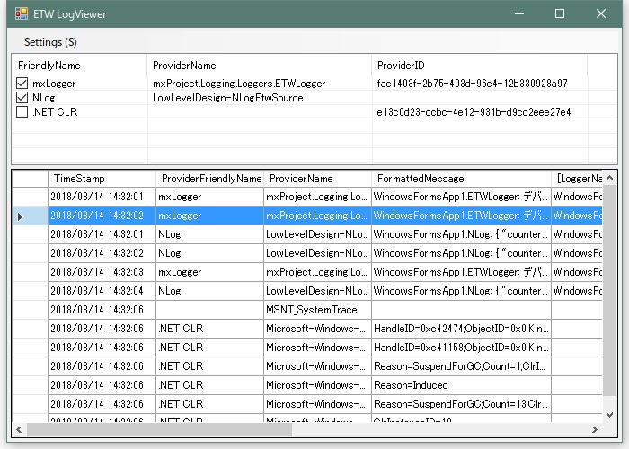

# EtwLogViewer

This tool is a simple ETW log viewer using EtwStream.




## Features ##

* Displays the trace event of the selected provider.
* Displays the value of each property of the TraceEvent class and the value of the payload. You can select the values to display.
* In the current version, tracing event filtering is not implemented.

## Requirement ##

* .NET Framework 4.6
* EtwStream.Core 1.3.3 (https://github.com/neuecc/EtwStream)

## Usage ##

#### Setting File (EtwLogViewer.config) ####

```xml
<?xml version="1.0" encoding="shift_jis"?>
<EtwLogViewerConfig
  xmlns:xsi="http://www.w3.org/2001/XMLSchema-instance"
  xmlns:xsd="http://www.w3.org/2001/XMLSchema">

  <!-- ETW Providers -->
  <Providers>
    <Provider FriendlyName="mxLogger"
        Name="mxProject.Logging.Loggers.ETWLogger"
        ID="{FAE1403F-2B75-493D-96C4-12B330928A97}" />
    <Provider FriendlyName="NLog"
        Name="LowLevelDesign-NLogEtwSource" />
    <Provider FriendlyName=".NET CLR"
        ID="{E13C0D23-CCBC-4E12-931B-D9CC2EEE27E4}" />
  </Providers>
  
  <!-- Known payloads -->
  <KnownPayloads>
    <string>LoggerName</string>
    <string>Sequence</string>
	<string>Time</string>
	<string>Message</string>
	<string>MemberName</string>
	<string>FilePath</string>
	<string>Line</string>
  </KnownPayloads>
  
  <!-- Visible fields -->
  <!--
    To specify the payload, add a dot before the item name.
    ex) .Message
  -->
  <Fields>
    <Field Name="TimeStamp" Width="120" />
    <Field Name="ProviderFriendlyName" Width="120" />
    <Field Name="ProviderName" Width="120" />
    <Field Name="FormattedMessage" Width="200" />
    <Field Name=".LoggerName" Width="100" />
    <Field Name=".Message" Width="200" />
    <Field Name=".Sequence" Width="70" />
    <Field Name=".Time" Width="120" />
    <Field Name=".MemberName" Width="100" />
    <Field Name=".FilePath" Width="100" />
    <Field Name=".Line" Width="50" />
  </Fields>
  
</EtwLogViewerConfig>
```

##### Providers #####

Describe the definition of the ETW providers to be displayed. Either Name or ID is required.

##### KnownPayloads #####

Describe the payload names displayed in the list.
This definition is not mandatory. When you write this definition, you can choose whether to display the payload fields in the list on the list configuration form.

##### Fields #####

Describe the definition of fields displayed in the list.
To specify the payload, add a dot before the field name.

|Field Name|Description|
|---|---|
|EventTypeUserData|Displays the value of EventTypeUserData property. See reference to TraceEvent class.|
|ProviderGuid|Displays the value of ProviderGuid property. See reference to TraceEvent class.|
|ProviderName|Displays the value of ProviderName property. See reference to TraceEvent class.|
|EventName|Displays the value of EventName property. See reference to TraceEvent class.|
|ID|Displays the value of ID property. See reference to TraceEvent class.|
|Task|Displays the value of Task property. See reference to TraceEvent class.|
|TaskName|Displays the value of TaskName property. See reference to TraceEvent class.|
|Opcode|Displays the value of Opcode property. See reference to TraceEvent class.|
|OpcodeName|Displays the value of OpcodeName property. See reference to TraceEvent class.|
|Level|Displays the value of Level property. See reference to TraceEvent class.|
|Version|Displays the value of Version property. See reference to TraceEvent class.|
|Keywords|Displays the value of Keywords property. See reference to TraceEvent class.|
|Channel|Displays the value of Channel property. See reference to TraceEvent class.|
|TimeStamp|Displays the value of TimeStamp property. See reference to TraceEvent class.|
|TimeStampRelativeMSec|Displays the value of TimeStampRelativeMSec property. See reference to TraceEvent class.|
|ThreadID|Displays the value of ThreadID property. See reference to TraceEvent class.|
|ProcessID|Displays the value of ProcessID property. See reference to TraceEvent class.|
|ProcessName|Displays the value of ProcessName property. See reference to TraceEvent class.|
|ProcessorNumber|Displays the value of ProcessorNumber property. See reference to TraceEvent class.|
|PointerSize|Displays the value of PointerSize property. See reference to TraceEvent class.|
|ActivityID|Displays the value of ActivityID property. See reference to TraceEvent class.|
|RelatedActivityID|Displays the value of RelatedActivityID property. See reference to TraceEvent class.|
|FormattedMessage|Displays the value of FormattedMessage property. See reference to TraceEvent class.|
|EventIndex|Displays the value of EventIndex property. See reference to TraceEvent class.|
|Source|Displays the value of Source property. See reference to TraceEvent class.|
|IsClassicProvider|Displays the value of IsClassicProvider property. See reference to TraceEvent class.|
|EventDataLength|Displays the value of EventDataLength property. See reference to TraceEvent class.|
|EventData|Displays the value of EventData property. See reference to TraceEvent class.|
|Dump|Displays the return value of Dump method. See reference to TraceEvent class.|
|Xml|Displays the return value of Xml method. See reference to TraceEvent class.|
|Payloads|Displays a concatenation of all payload names and values. (name1:value1; name2:value2; name3:value3; ...)|
|ProviderFriendlyName|Displays the FriendlyName of the provider defined in this configuration file.|
        
## Licence ##

[MIT Licence](http://opensource.org/licenses/mit-license.php)
